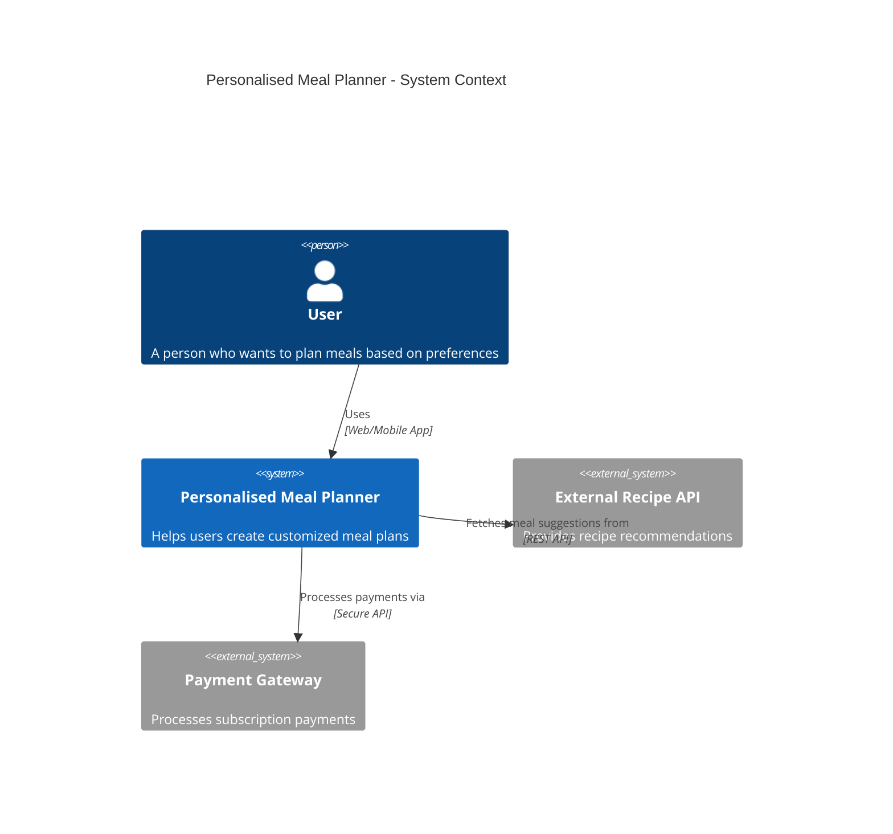
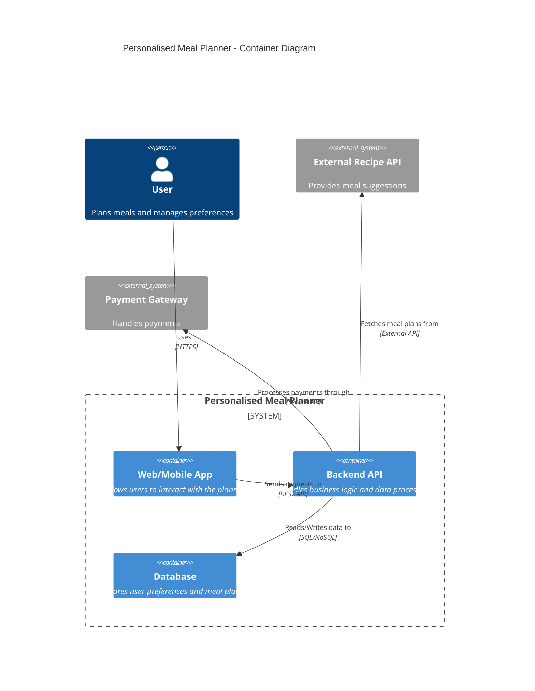
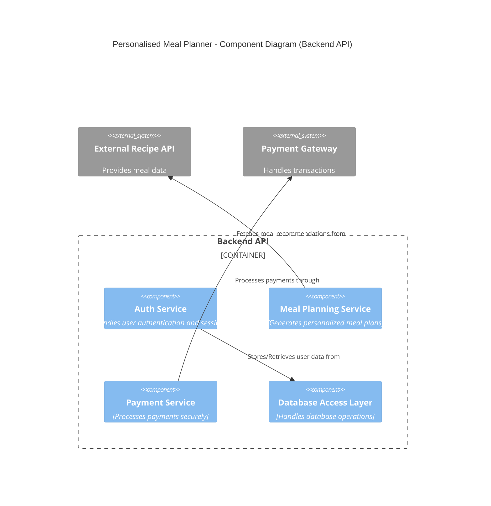
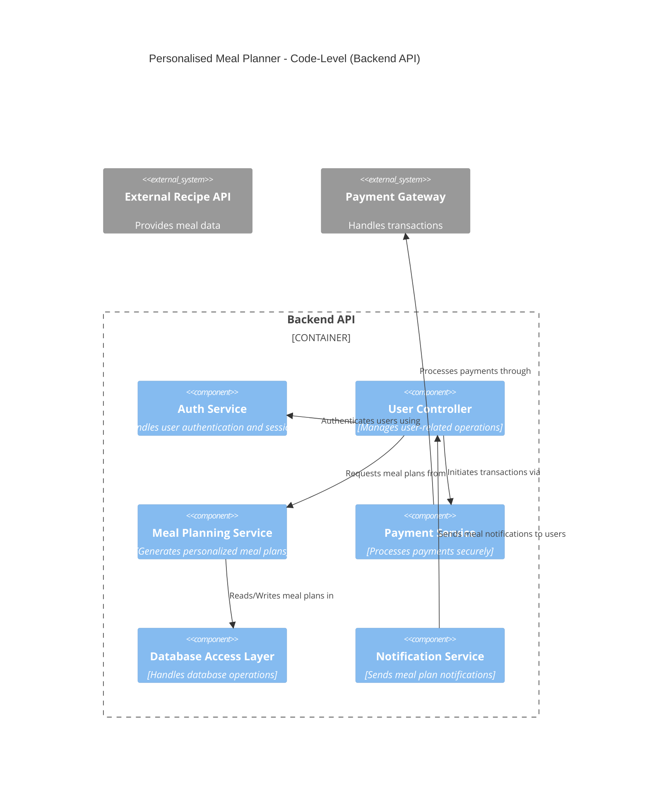
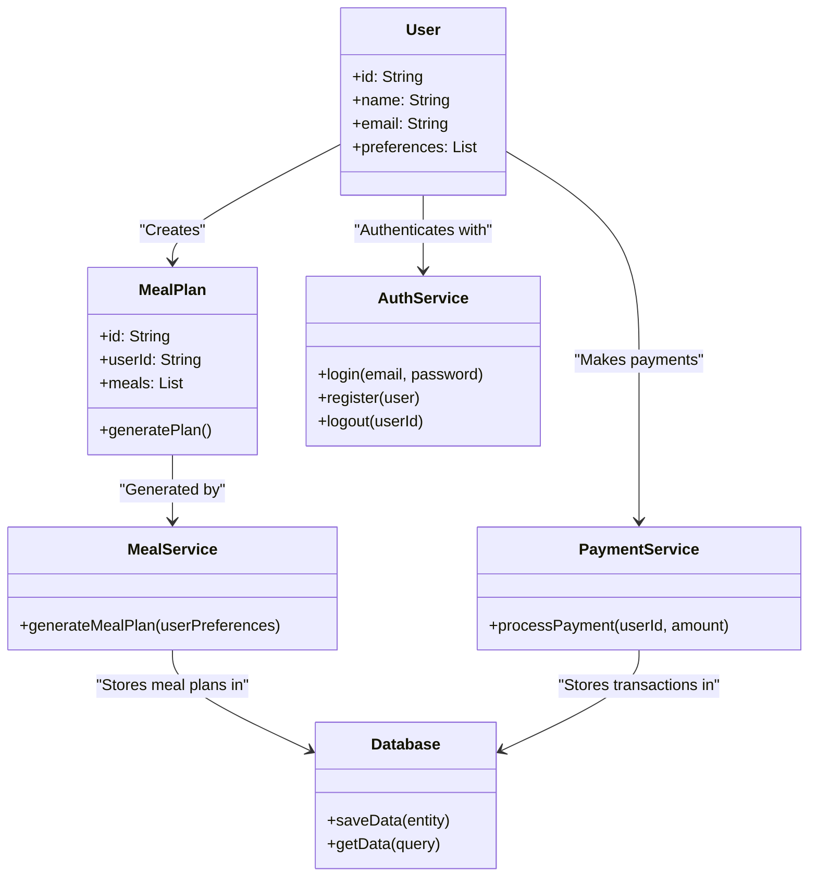

# Architecture of the Personalised Meal Planner

## Overview

The Personalised Meal Planner is designed to provide users with customized meal plans based on their preferences. The system consists of a web/mobile application, a backend API, and integrations with external services like a recipe provider and a payment gateway.

## Domain

Health and nutrition

## C4 Model

### **Context Diagram (C4 Level 1)**

### **Container Diagram (C4 Level 2)**

### **Component Diagram (C4 Level 3)**

### **Code-Level Diagram (C4 Level 4)**

### **UML-Class Diagram Alternative**

