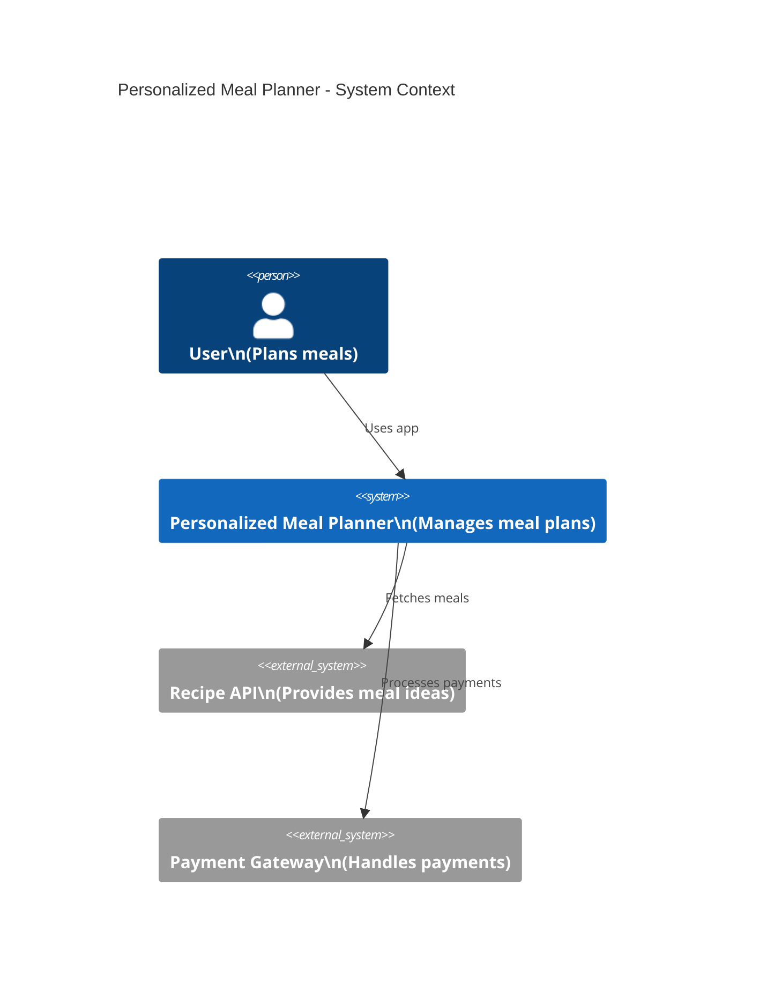
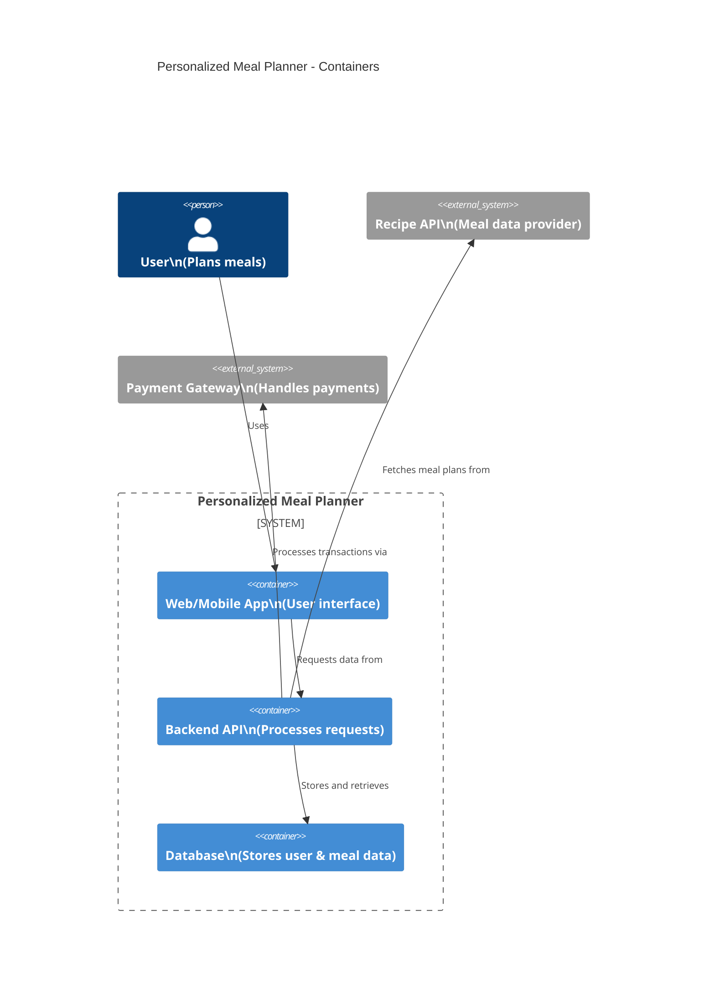
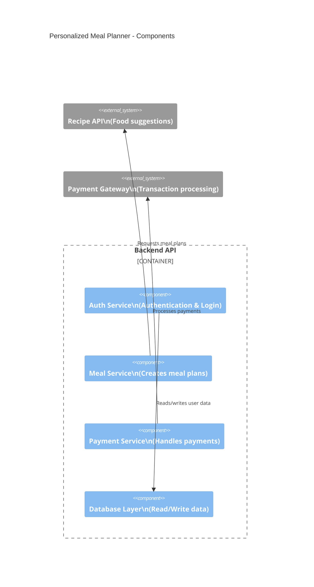
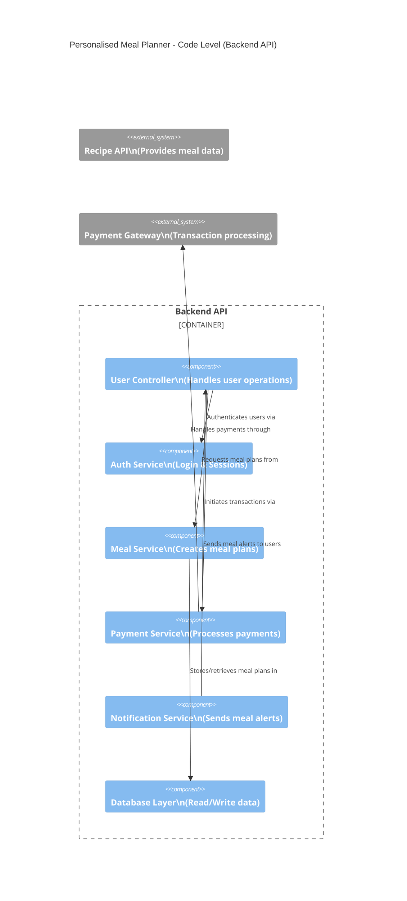
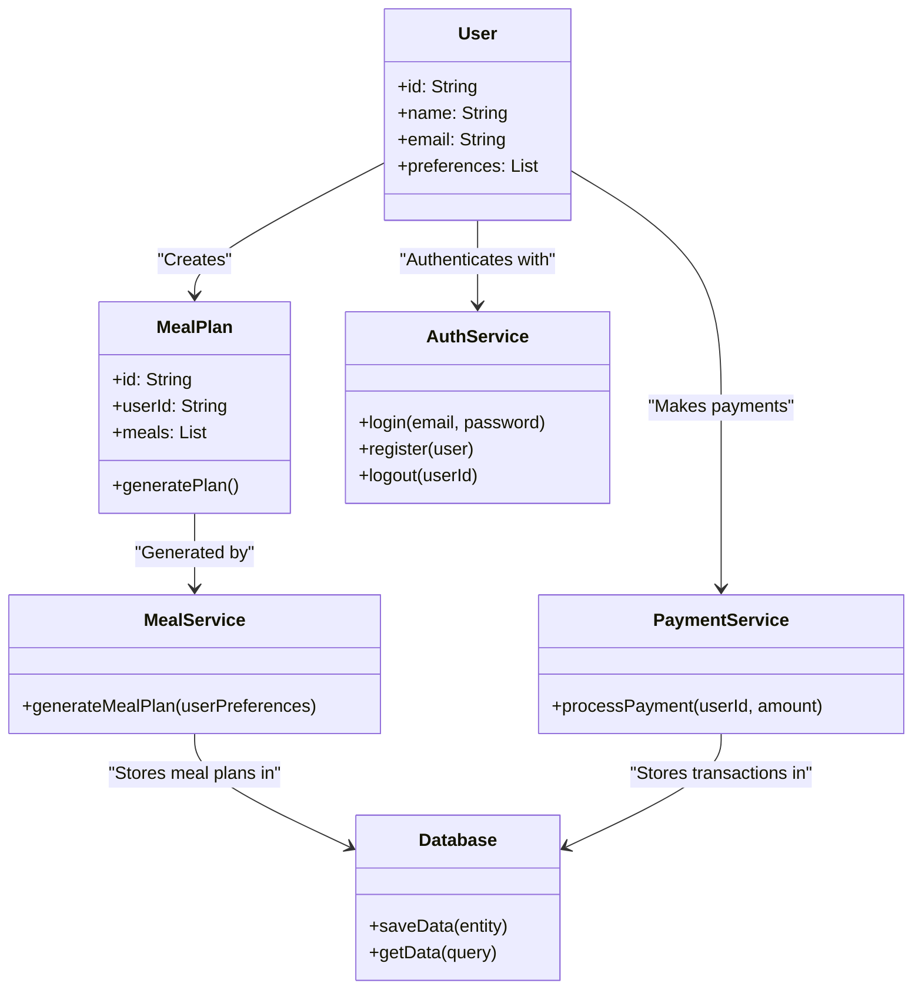

# Architecture of the Personalised Meal Planner

## Overview
The Personalised Meal Planner is designed to provide users with customized meal plans based on their preferences. The system consists of a web/mobile application, a backend API, and integrations with external services like a recipe provider and a payment gateway.
## Domain
Health and nutrition
## Problem Statement
Many individuals struggle with meal planning due to time constraints, lack of nutritional knowledge, or dietary restrictions. The **Personalised Meal Planner** aims to simplify this process by generating customized meal plans based on user preferences, dietary goals, and health conditions. The system will integrate external recipe APIs and provide a subscription-based model for premium features.
## System Architecture 
The system is structured into **four main components**:
1. **Frontend (Web & Mobile Application)**
2. **Backend API**
3. **Database**
4. **External Services** (Recipe API, Payment Gateway)
## C4 Model

### **Context Diagram (C4 Level 1)**

### **Container Diagram (C4 Level 2)**

### **Component Diagram (C4 Level 3)**

### **Code-Level Diagram (C4 Level 4)**

### **UML-Class Diagram Alternative**

