```mermaid

graph TD;
    %% Actors
    User["👤 User"]
    Admin["👤 Admin"]
    Nutritionist["👤 Nutritionist"]
    System["🤖 System"]
    DeliveryService["🚚 Delivery Service"]
    PaymentGateway["💳 Payment Gateway"]

    %% Use Cases
    U1["Select Meal Plan"]
    U2["Set Dietary Preferences"]
    U3["Generate Shopping List"]
    U4["Log Meal Consumption"]
    U5["Receive Nutrition Insights"]
    U6["Order Meal Delivery"]
    U7["Make Payment"]
    U8["Manage Recipes"]

    %% Relationships
    User -- Selects --> U1
    User -- Sets --> U2
    User -- Generates --> U3
    User -- Logs --> U4
    User -- Receives --> U5
    User -- Orders --> U6

    Admin -- Manages --> U8

    Nutritionist -- Recommends --> U1
    Nutritionist -- Reviews --> U5

    System -- Suggests --> U1

    DeliveryService -- Processes --> U6

    PaymentGateway -- Handles --> U7

```

## Key Actors' Roles:

 User: User - the primary user who chooses meal plans, logs meals, and receives nutritional information.

 Admin: The admin is responsible for managing recipes, monitoring user interaction, and ensuring the system's functionality.
 
 Nutritionist: The nutritionist generates dietary recommendations and verifies the nutritional accuracy of meals.

 System: The system suggests meal plans based on the user's preferences and syncs with calendars.

 Delivery Service - This handles food deliveries when customers place orders.

 Payment Gateway - This handles safe transactions for paid meal plans and delivery.

 ## Relationships between actors and use cases:

User → Meal Planner: The user selects a meal plan and logs meals to track progress.

User → Preferences: The user sets dietary restrictions, which affect meal recommendations.

Admin → Recipe Database: Admin manages the list of available meals, ensuring variety and accuracy.

Nutritionist → Insights: The nutritionist verifies and enhances health insights for users.

System → Meal Suggestions: The system automatically recommends meals based on the user's dietary preferences.

Delivery Service → Order Handling: When users place an order, the delivery service ensures fulfillment.

Payment Gateway → Transactions: If a user subscribes to a paid plan or orders meals, the payment gateway processes the transaction.

## Reflections and Challenges

The creation of a meal plan application was the main goal of this project. The main objective was to develop an intuitive platform that would make meal planning easier by including features like nutritional tracking, automated shopping list creation, and customizable plan selection. From requirements analysis to implementation and testing, the development lifecycle offered important insights into project management and software engineering techniques.

A functional grasp of the application's architecture and component interactions was one of the project's major accomplishments. The significance of planning for seamless integration was brought to light by tracking the data flows between the nutrition analysis engine, recipe database, and user interface. The program offers a simplified user experience that satisfies the main project objectives by offering features including meal plan selection, customizable dietary preference settings, account creation, and dynamic shopping list generation. 

Nevertheless, many difficulties occurred during the development process. The application of the Mermaid diagram was one particular challenge. For the graphic to accurately depict the system architecture and data flow, iterative development necessitated constant changes. It took work to keep the diagram consistent with the changing codebase.

Complexity was also introduced by the inclusion of actors and the roles that went along with them. Careful planning and execution were necessary to manage user roles, permissions, and data access effectively. To properly control user access, a thorough grasp of the design was necessary.

Addressing these difficulties required a re-evaluation of data flows, with a focus on actor interactions and potential failure points. Error management and input validation proved critical to maintaining data integrity and preventing unwanted access. This initiative required thorough testing, code reviews, and problem-solving. Future initiatives will require better early planning and design.

Finally, the Meal Plan application project provided a valuable learning experience. I gained a greater understanding for software engineering principles and processes. Successfully navigating these obstacles sharpened my problem-solving talents and reinforced my passion for developing solutions. The program acts as a proof of concept for cooperation and transforming ideas into potentially useful tools.
