```mermaid

graph TD;
    %% Actors
    User["👤 User"]
    Admin["👤 Admin"]
    Nutritionist["👤 Nutritionist"]
    System["🤖 System"]
    DeliveryService["🚚 Delivery Service"]
    PaymentGateway["💳 Payment Gateway"]

    %% Use Cases
    U1["Select Meal Plan"]
    U2["Set Dietary Preferences"]
    U3["Generate Shopping List"]
    U4["Log Meal Consumption"]
    U5["Receive Nutrition Insights"]
    U6["Order Meal Delivery"]
    U7["Make Payment"]
    U8["Manage Recipes"]

    %% Relationships
    User -- Selects --> U1
    User -- Sets --> U2
    User -- Generates --> U3
    User -- Logs --> U4
    User -- Receives --> U5
    User -- Orders --> U6

    Admin -- Manages --> U8

    Nutritionist -- Recommends --> U1
    Nutritionist -- Reviews --> U5

    System -- Suggests --> U1

    DeliveryService -- Processes --> U6

    PaymentGateway -- Handles --> U7

```

## Key Actors' Roles:

 User: User - the primary user who chooses meal plans, logs meals, and receives nutritional information.

 Admin: The admin is responsible for managing recipes, monitoring user interaction, and ensuring the system's functionality.
 
 Nutritionist: The nutritionist generates dietary recommendations and verifies the nutritional accuracy of meals.

 System: The system suggests meal plans based on the user's preferences and syncs with calendars.

 Delivery Service - This handles food deliveries when customers place orders.

 Payment Gateway - This handles safe transactions for paid meal plans and delivery.

 ## Relationships between actors and use cases:

User → Meal Planner: The user selects a meal plan and logs meals to track progress.

User → Preferences: The user sets dietary restrictions, which affect meal recommendations.

Admin → Recipe Database: Admin manages the list of available meals, ensuring variety and accuracy.

Nutritionist → Insights: The nutritionist verifies and enhances health insights for users.

System → Meal Suggestions: The system automatically recommends meals based on the user's dietary preferences.

Delivery Service → Order Handling: When users place an order, the delivery service ensures fulfillment.

Payment Gateway → Transactions: If a user subscribes to a paid plan or orders meals, the payment gateway processes the transaction.
