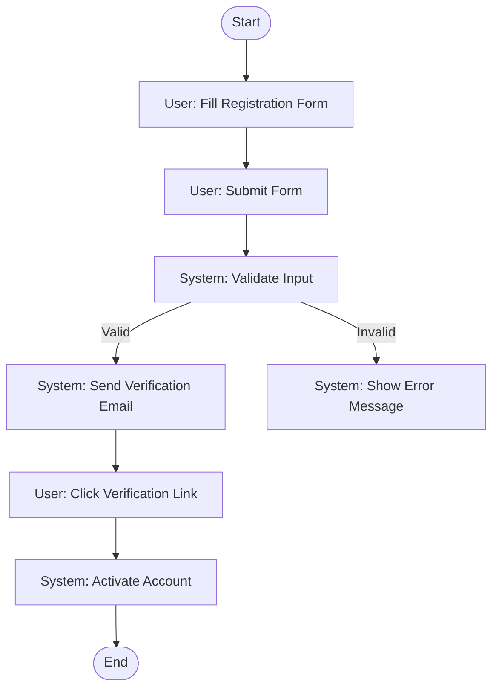
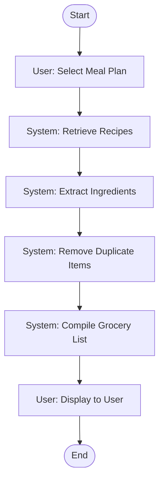
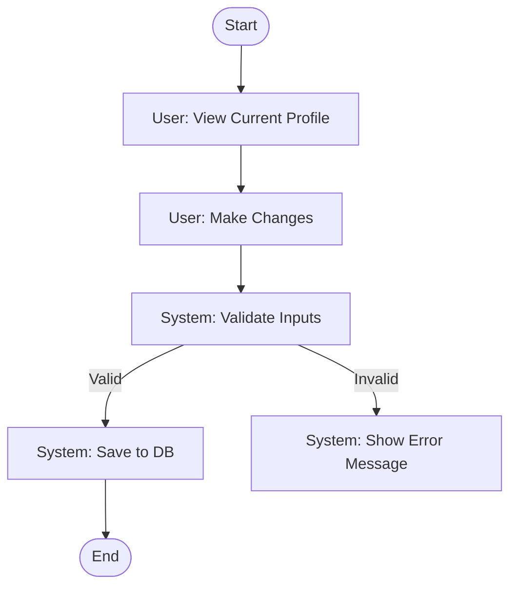
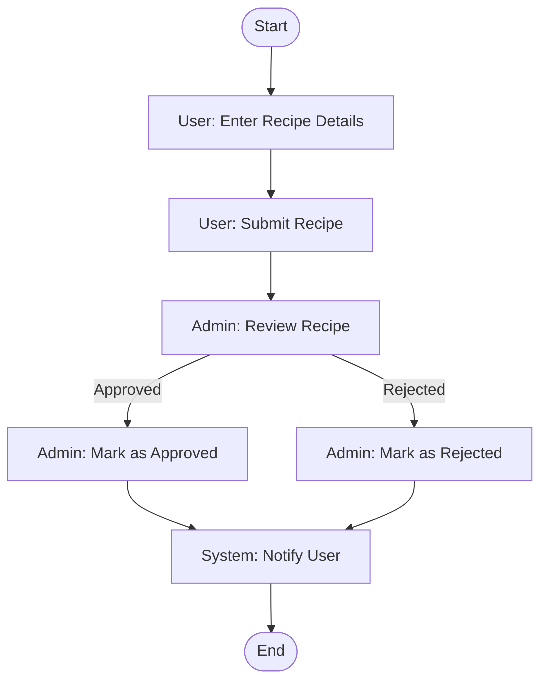
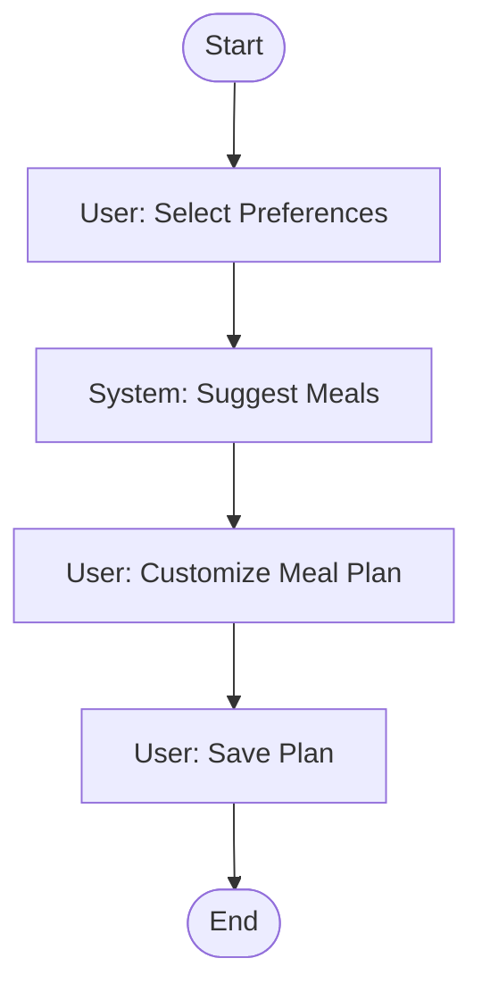
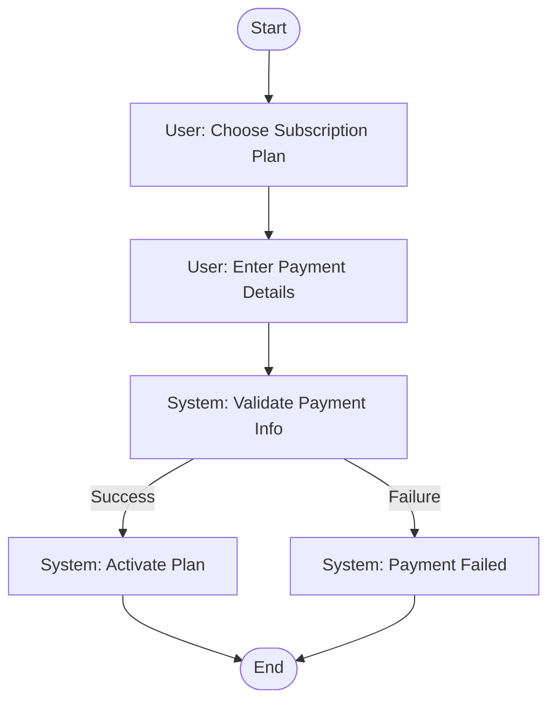
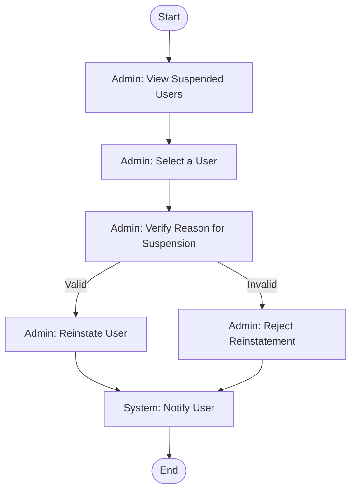
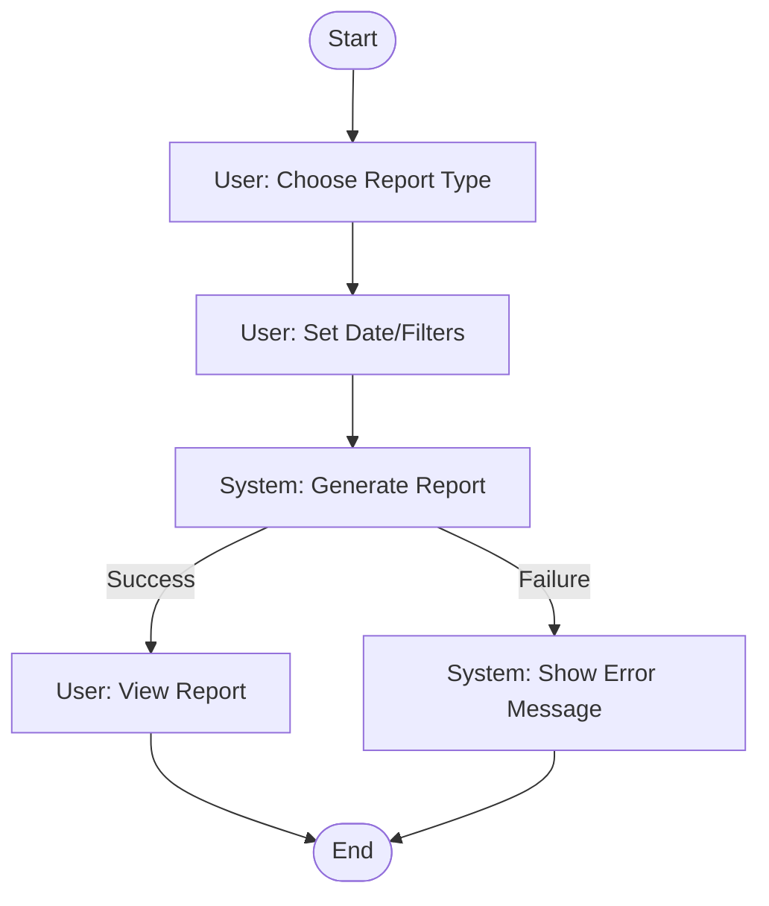

# 🔄 Activity Workflow Modeling - Personalised Meal Planner

 Workflows are broken down into 8 main activities.

---

## 1. 👤 User Registration

📝 *This diagram addresses the need for secure onboarding by validating inputs and confirming emails before account activation.*

---

## 2. 🛒 Generate Grocery List

📝 *Streamlines ingredient management ensuring accurate, duplicate-free grocery lists, reducing user workload.*

---

## 3. 🧬 Update Dietary Profile

📝 *Ensures dietary needs are correctly captured and validated before updating profile.*

---

## 4. 📋 Submit Recipe

📝 *Aligns with the moderation process to maintain recipe quality and notify users transparently.*

---

## 5. 🥗 Create Meal Plan

📝 *Addresses user flexibility with customizable, system-suggested plans.*

---

## 6. 💳 Subscription Workflow

📝 *Ensures robust validation before enabling paid features, addressing financial reliability.*

---

## 7. 🛠️ Admin Reinstates User

📝 *Ensures fair decision-making for reinstatements with appropriate admin verification.*

---

## 8. 🧾 Generate Report

📝 *Empowers users with insights and monitoring of progress through dynamic reports.*

---
