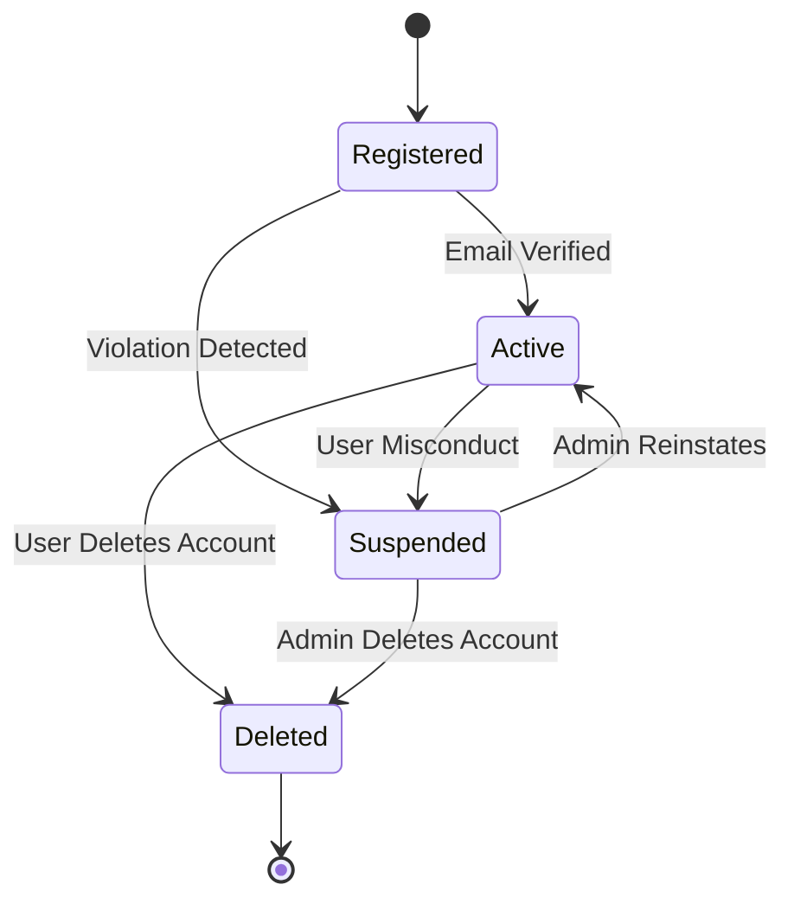
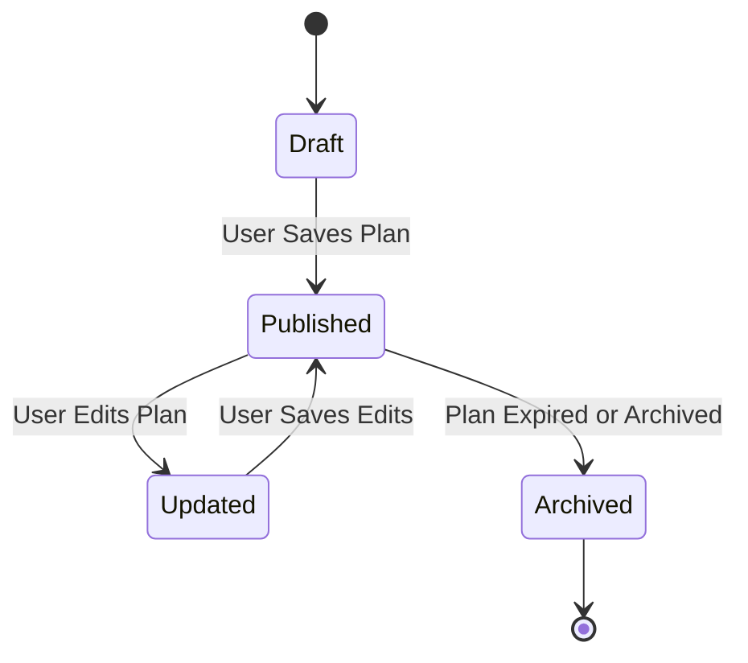
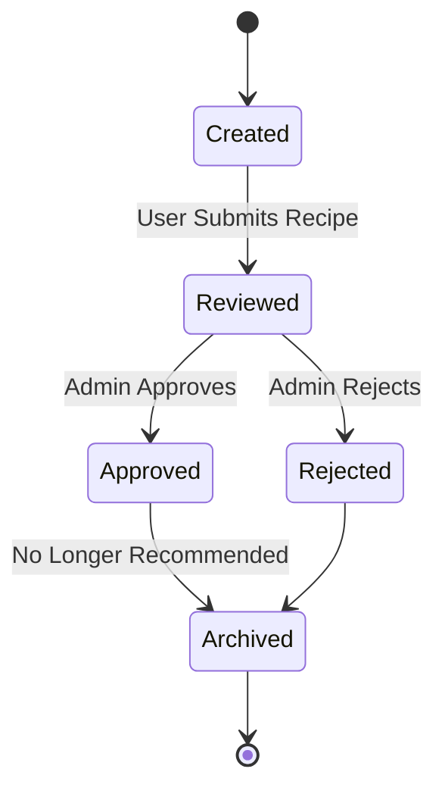
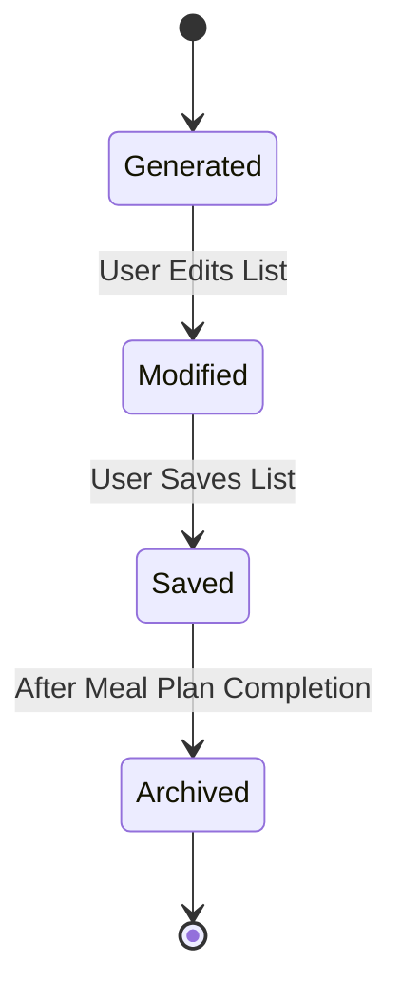
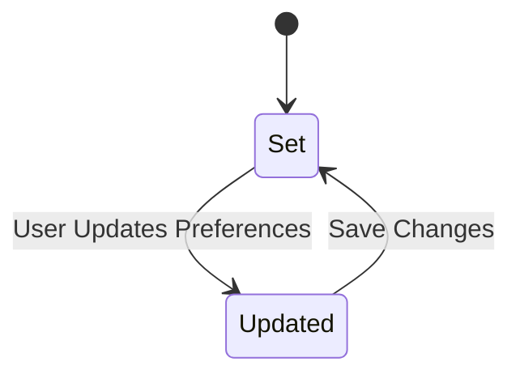
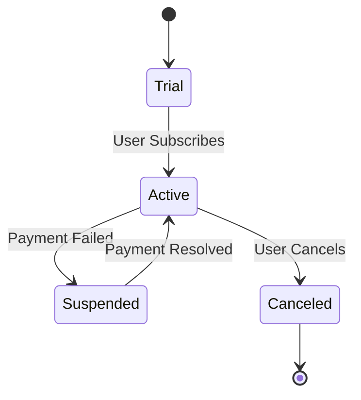
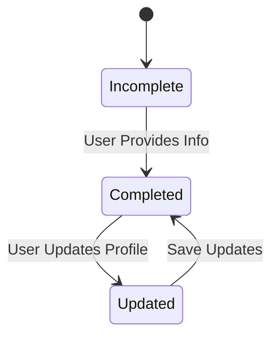
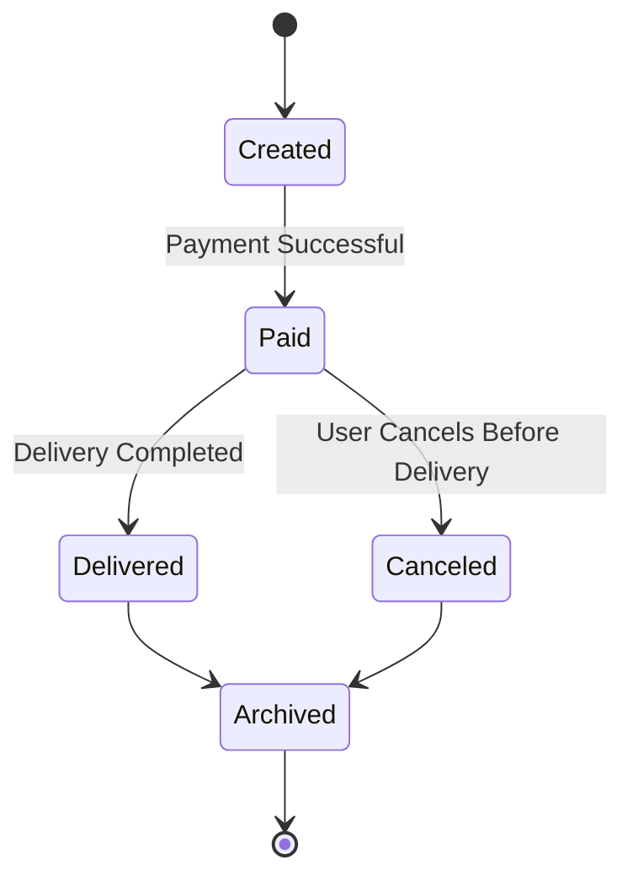

# 📊 State Transition Diagrams - Personalised Meal Planner

All diagrams use `stateDiagram

---

## 1. 👤 User Account

---

## 2. 🥗 Meal Plan

---

## 3. 📋 Recipe

---

## 4. 🛒 Grocery List

---

## 5. 🍽️ Meal Preference

---

## 6. 💳 Subscription

---

## 7. 🧬 Dietary Profile

---

## 8. 📦 Order (Optional)

